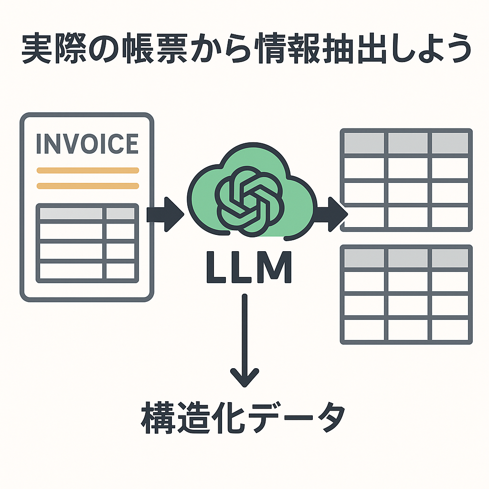

# part2_extract_info



## セットアップ

### 1. 必要な環境

- Python 3.10 以降
- uv（Python パッケージマネージャー）

### 2. uv のインストール

```bash
curl -LsSf https://astral.sh/uv/install.sh | sh
```

### 3. 依存関係のインストール

```bash
uv install
```

### 4. 実行

```bash
uv run python main.py
```
